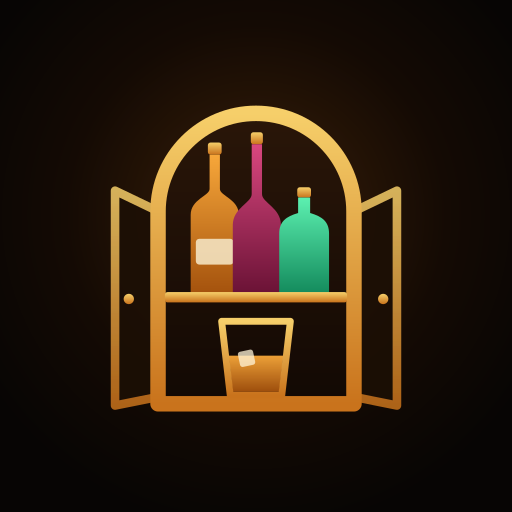

<p align="center">
  
</p>

<h1 align="center">Liquor Cabinet</h1>

<p align="center">
  A party planner for <b>Android</b> and <b>iPhone</b>. Stock the bar with live <b>Livcheers</b> prices, mix cocktails and mocktails from what you bought,<br>
  work out the food with the calculator, then order from restaurants near you on <b>Zomato</b>, 10-minute snacks on <b>Bistro</b> and supplies on <b>Blinkit</b>, <b>Zepto</b> or <b>Instamart</b> —<br>
  and afterwards get everyone home and settle up.
</p>

<p align="center">
  <a href="https://github.com/ShadowSlayer08/Liquor-Cabinet/releases/latest"><b>⬇ Download v1.4.1 — Android APK &amp; iPhone IPA</b></a><br>
  <sub>or straight from the repo: <a href="release/LiquorCabinet-1.4.1.apk">APK</a> · <a href="release/LiquorCabinet-1.4.1-unsigned.ipa">IPA</a> · free, non-commercial, personal use — see <a href="#data-sources--legal-notice">legal notice</a></sub>
</p>

---

## Install

### Android

1. On your Android phone, download `LiquorCabinet-1.4.1.apk` from the [latest release](https://github.com/ShadowSlayer08/Liquor-Cabinet/releases/latest) (or [`release/`](release/LiquorCabinet-1.4.1.apk) in the repo).
2. Open it. When Android asks, allow installs from that source.
3. Launch **Liquor Cabinet**, tap **Use my location**, then **⚡ Smart Sync** to pull today's prices.

It needs **Android 8.0 or newer** and an internet connection. v1.4.1 installs over v1.0–v1.4 and keeps your carts.
It asks for **location** (restaurants that deliver to you), **notifications** (order checklist and party reminders) and, only if you turn on the floating checklist, **display over other apps**. All are optional.

### iPhone (beta, sideload)

The same app runs on iPhone (iOS 15+). There's no App Store listing, and an iPhone won't install an app file the way Android does — it has to be signed with an Apple ID when you install it:

1. Download `LiquorCabinet-1.4.1-unsigned.ipa` from the [latest release](https://github.com/ShadowSlayer08/Liquor-Cabinet/releases/latest) (every push also builds one: [iOS workflow](https://github.com/ShadowSlayer08/Liquor-Cabinet/actions/workflows/ios.yml) → Artifacts).
2. Install it with [Sideloadly](https://sideloadly.io/) (Windows / Mac) or [AltStore](https://altstore.io/), signing in with your own Apple ID.
3. On the iPhone: Settings → General → VPN & Device Management → trust your Apple ID; on iOS 16+ also turn on Settings → Privacy & Security → **Developer Mode**.

With a free Apple ID the app runs for 7 days before it must be re-signed (AltStore can refresh it automatically), and you can have at most 3 sideloaded apps. A paid Apple Developer account (US$99/year) gives 1-year installs for up to 100 iPhones, or TestFlight. _At the time of writing._

Different on iPhone: there's no floating checklist bubble — iOS doesn't let apps draw over other apps — so the order checklist arrives as a notification. Everything else is the same app; the beta features (Zomato sign-in, live Blinkit prices) are as untested on iPhone as on Android.

## What's new in v1.4.1

Host features — the app now helps before, during and after the party:

- **🪄 Fill my bar** — tell it the budget and the kind of night (mixed bar, whisky night, beer & wine, light & easy, or "match my cocktails") and it picks the best-rated bottles that cover your guests within budget. Pin bottles you want, skip ones you don't, then add the lot in one tap. From the Cabinet hero, the Food tab's drinks gauge or an empty cart.
- **🧃 Mocktails** — 22 alcohol-free drinks in the Bar tab (Cocktails | Mocktails), and the drinks gauge offers one for the guests who aren't drinking.
- **🍸 75 cocktails** (up from 28), with taste tags (refreshing, fruity, strong, desi…).
- **✨ Suggestions for your party** — the Bar tab picks cocktails and mocktails that suit your bottles and what your guests like; the Food tab ranks 60 dishes (up from 26) by what pairs with your bottles, your guests' cuisines and spice level, and what they don't eat (mutton, seafood, egg…, or Jain). Each pick says why.
- **🎉 Party templates** — Match night, Diwali, New Year's Eve, Birthday, Dinner party, Game night and Holi brunch fill in the guests, hours, drinks mix and dinner in one tap (festival dates included).
- **🚕 Getting home safely** — mark who's driving (they're counted as not drinking), then a Plan card opens **Uber** or **Ola** with the party as the pickup, or **Rapido** / **DriveU** (a driver for your own car); share the ride links on WhatsApp. A "last call" reminder 45 minutes before the end.
- **🧾 Settle up** — after the party, enter what was really spent and who paid; it works out the fewest payments to square everyone up, with a UPI QR for each. A reminder the morning after.
- **🛒 More grocery apps** — send the supplies list to **Zepto** or **Swiggy Instamart** instead of Blinkit.
- **⚖️ Legal notice in the app** — the "Data sources & legal notice" below is now in the app too (Plan tab and welcome screen).
- Dish tiles keep their illustrations (they no longer switch to a Zomato restaurant photo).

## What's new in v1.4

- **iPhone** (beta): the same app on iOS 15+, installed by sideloading the IPA (see above). Built and tested in the iOS Simulator on GitHub's macOS runners — not yet on a real iPhone.
- **Paying your share**: the WhatsApp split message no longer contains `upi://pay` links (UPI has blocked person-to-person payments started from links since 2024) — it gives the UPI ID, and the payment card's QR codes still work.
- **Privacy**: the welcome screen now says plainly that your location goes to Zomato to find restaurants that deliver to you (and it's sent rounded to ~10 m).
- **Safer storage**: your party plan and carts are kept in the phone's own storage, not just the web view's.
- **Links**: `liquorcabinet://tab/bar`, `…/tab/cart?view=food`, `liquorcabinet://sync` open the app where you want it.

## What's new in v1.3

- **🍸 Bar tab** — 28 cocktails; the ones you can make with the bottles in your cabinet come first. Put a few on the party menu and their extras (mint, juices, ginger ale…) land on your Blinkit list, replacing the default mixer so nothing is counted twice.
- **🚫 Dry days** — set the party date and time. National dry days (26 Jan, 15 Aug, 2 Oct) show a red "buy by…" warning; festival and state days an amber "check your state" one. Add your own (e.g. an election ban) in the Plan tab.
- **↓ Price drops** — every sync remembers the last prices, so bottles that got cheaper (or dearer) get a badge, a **Price drops** filter and a price history.
- **📍 Find a liquor store** — opens Google Maps with liquor stores near you.
- **💸 Split the bill** — equal, or fair (only drinkers pay for the bar). Share the amounts on WhatsApp with UPI pay links, or as an image with a UPI QR code per share.
- **💌 Invite card** — a party invite image (name, date, venue, what's on the bar and the menu) to share anywhere.
- **⏰ Reminders** — notifications to stock the bar (a day early — or before a dry day), chill the beer, order mixers, starters and dinner. Change the party time and it offers to move them.
- **Exact Zomato prices (beta)** — sign in to Zomato once inside the app and restaurant menus show their real prices instead of a "cost for one" estimate.
- **Live Blinkit prices (beta)** — on the phone, a supply can be checked against Blinkit's own search page (your connection, your delivery location) instead of the usual MRP.
- **Floating checklist (beta)** — your order as a gold bubble on top of Zomato, Bistro and Blinkit; tap to open the list and tick items off as you add them.

## What it does

| Tab | |
| --- | --- |
| 🥃 **Cabinet** | A hero dashboard (bottles, drinks covered, budget left, cocktails you can make, dry-day warning, store finder, **Fill my bar**), illustrated category tiles and an **Editor's picks** carousel. Every Livcheers category (single malts, blended scotch, Indian whisky, world whisky, gin, rum, vodka, tequila, brandy, beer, red/white/rosé/sparkling wine, champagne, liqueurs, sake, ready-to-drink) with prices for 30 Indian cities. Filter by Editor's Choice / Best Pick / Good Value, India vs imported, or **price drops**; search; sort by price, rating or value for money. Tap a bottle for rating bars, tasting notes, price history and food pairings. |
| 🍸 **Bar** | 75 cocktails and 22 mocktails. Cocktails you can make with your bottles come first (the rest show which spirit they need), with a "Picked for your party" row based on your bottles and your guests' tastes. Recipes with per-glass ingredients and steps, and a party menu that feeds the supplies list. |
| 🍽️ **Food** | The calculator. Start from a party template or set the party name, date and time, guests, hours, how many are drinking (and driving), vegetarian share, appetite, peg size (30/60 ml), whether there's dinner, and what your guests like. It tells you whether your bottles cover the night, then works out mixers, soft drinks, ice, water, lemons, cocktail extras, munchies, cups/plates/napkins, starter plates, main servings, breads and desserts. 60 dishes, ranked for your party, each saying why ("pairs with your whisky", "your guests like Chinese"). Pick a dish to see Zomato restaurants that deliver **to your GPS location**, open a restaurant's **real menu** and add exact dishes. A **Bistro** tab lists 10-minute snacks where Bistro operates. |
| 🛒 **Cart** | Your liquor list (share it, or find a store nearby) plus the food & supplies cart: exact Zomato dishes grouped by restaurant, the Bistro order and the supplies checklist for Blinkit, Zepto or Instamart, each with a **Send order** button. |
| 📊 **Plan** | Budget ring and spend donut, invite card, bill split and **settle up**, reminders, **getting home** (rides and designated drivers), dry days ahead, location, shopping batches, Zomato account, floating checklist, how fresh the price data is, and the legal notice. |

## Where the data comes from

The app collects its own data on the phone. There are no API keys and no AI services involved.

- **Liquor: Livcheers.** The app reads each `livcheers.com/<city>/category/<type>` page directly and pulls out every product: price, ratings (taste, value, rebuy), tasting notes, origin, bottle photo and product link. Prices are stored on the phone for 7 days; **Force Refresh** downloads them again. Each sync is compared with the last one to spot price changes.
- **Location.** Your phone's GPS picks the nearest Livcheers city, and Zomato's own location service turns it into your delivery zone, so restaurants and distances are for your address.
- **Food: Zomato.** For each dish, the app loads Zomato's page for it and lists the restaurants that deliver it to you, with rating, "₹X for one", delivery time and distance. Restaurant menus come from the restaurant's Zomato page. Zomato hides item prices from logged-out visitors, so dishes are estimated with the restaurant's "cost for one" — unless you sign in to Zomato inside the app (beta).
- **Food: Bistro.** Bistro publishes no menu or prices online, so it has a list of its canteen-style items, marked "price in app".
- **Supplies: Blinkit, Zepto or Instamart.** These apps block automated price lookups, so the planner comes with common mixers, snacks, ice and disposables at their usual MRP. On the phone you can check a live Blinkit price (beta): the app opens Blinkit's search page in a hidden browser on your own connection and reads the product cards.
- **Rides: Uber, Ola, Rapido, DriveU.** Nothing is fetched — the app only opens their app (Uber and Ola with the party's location as the pickup).
- **Dry days.** National dry days are certain; everything else is notified by each state (often quarterly), so festival and state days are shown as "check", with a link to verify.

## Ordering

Zomato, Bistro, Blinkit, Zepto and Instamart don't let other apps add items to your cart, so Liquor Cabinet opens exactly the right place in their apps, copies your list, and **pins an order checklist to your notifications** — and, if you turn it on, a **floating checklist bubble** over their apps:

- **Zomato:** opens the chosen restaurant's menu in the Zomato app (`zomato://order/<id>`), or zomato.com.
- **Bistro:** launches the Bistro app (`com.blinkit.bistro`), or bistro.blinkit.com.
- **Blinkit / Zepto / Instamart:** opens each supply as a search in the app you picked; **Next item** moves down the list.

Liquor itself isn't sold on any of them. Share the liquor list and tap **Find a liquor store near you**.

## Project layout

```
src/
  App.jsx                 app shell: header, 5 tabs, carts, persistence
  components/             Cabinet, Bar, Food, Cart, Plan tabs + sheets; plan/ holds the Plan tab's cards
  lib/parse/livcheers.js  Livcheers page parser (categories, cities, tiers)
  lib/parse/zomato.js     Zomato dish-page + restaurant-menu parser (menu prices when signed in)
  lib/location.js         GPS → nearest city + Zomato delivery zone, Bistro areas
  lib/food.js             party calculator, Blinkit supply list;  lib/dishes.js the 60 dishes and their tags
  lib/cocktails.js        cocktails and mocktails, what's makeable, cocktail supplies
  lib/suggestDrinks.js    drinks picked for the party;  lib/suggestFood.js dishes ranked for it;  lib/prefs.js guest preferences
  lib/optimise.js         "Fill my bar" budget optimiser;  lib/templates.js party templates
  lib/rides.js            rides home + designated drivers;  lib/settle.js settle-up after the party
  lib/grocers.js          Blinkit / Zepto / Instamart;  lib/legal.js the in-app legal notice (tested against the source)
  lib/drydays.js          dry-day tiers per state, custom dry days
  lib/pricehist.js        price-change badges and history between syncs
  lib/split.js            bill split + UPI links;  lib/paycard.js, invite.js, canvas.js, shareImage.js draw and share the images
  lib/reminders.js        party reminders (reminderPlan.js / when.js hold the pure parts)
  lib/blinkitLive.js      live Blinkit prices (beta);  lib/bubble.js floating checklist;  lib/zomatoAccount.js Zomato sign-in
  lib/sources.js          scrapers with on-device caching
  lib/order.js            Zomato / Bistro / Blinkit / Maps hand-off, checklist notification, haptics
android/                  Capacitor Android project; native plugins in app/src/main/java/…/liquorcabinet:
                          ExternalAppPlugin (open other apps), WebRenderPlugin (hidden page reader), OrderBubblePlugin (overlay)
ios/                      Capacitor iOS project (Swift Package Manager); ios/App/App has the Swift plugins:
                          ExternalAppPlugin, WebRenderPlugin, CookieBridgePlugin (Zomato sign-in cookies)
.github/workflows/        android.yml (tests + debug APK), ios.yml (unsigned IPA + Simulator screenshots)
resources/logo-mark.svg   the logo; `npm run icons` renders every icon + splash from it
docs/                     HANDOFF.md (status), ROADMAP.md (what's next), RESEARCH.md (data sources), original JSX, screenshots
CLAUDE.md                 guide for Claude Code sessions
tests/                    calculator, cocktails, suggestions, optimiser, templates, rides, settle-up, grocers, legal notice, dry days, split,
                          reminders, invite, price history, Blinkit, Zomato menu + live parser tests
release/                  the built APK and unsigned IPA
```

## Build from source

You need Node 20+, JDK 21 and the Android SDK (platform 36). Point Gradle at the SDK with `ANDROID_HOME` or `android/local.properties` (`sdk.dir=…`, git-ignored).

```bash
npm install
npm test          # unit tests + live Livcheers/Zomato parser tests
npm run dev       # preview in a desktop browser (a dev proxy stands in for native HTTP)
npm run icons     # regenerate launcher icons and splash screens from the logo
npm run apk       # → android/app/build/outputs/apk/release/LiquorCabinet-<version>-release.apk
```

`npm run apk` works on Windows, macOS and Linux (it runs the Gradle wrapper through `scripts/gradle.mjs`).

**iOS** builds need Xcode on a Mac: `npx vite build && npx cap sync ios`, then open `ios/App/App.xcodeproj`. Without a Mac, push to GitHub — the iOS workflow builds the unsigned IPA on GitHub's macOS runners (free for public repos).

To sign a release, create `android/keystore.properties` (git-ignored). Without it, release builds are signed with the debug key.

```
storeFile=keystore/your-key.jks
storePassword=…
keyAlias=…
keyPassword=…
```

## Data sources & legal notice

**Liquor Cabinet is a free, non-profit, personal-use hobby project.** It is not sold, has no ads, subscriptions, affiliate links or sponsored bottles, and makes no money in any way.

To do its job, the app connects — from your own phone, only when you use the related feature — to these third-party services:

| Service | What the app uses it for |
| --- | --- |
| **Livcheers** (livcheers.com) | Liquor prices, ratings and tasting notes for your city |
| **Zomato** (zomato.com) | Your delivery zone, restaurants that deliver a dish to you, restaurant menus; opening your order in the Zomato app |
| **Blinkit** / **Bistro** (blinkit.com) | Opening your supply list or order in their apps; an optional live price check (beta) |
| **Zepto** (zeptonow.com) | Opening your supply list in Zepto, if you pick it |
| **Swiggy Instamart** (swiggy.com) | Opening your supply list in Instamart, if you pick it |
| **Uber** (m.uber.com) / **Ola** (book.olacabs.com) | Opening a ride home with your pickup filled in |
| **Rapido** (rapido.bike) | Opening the Rapido app for a ride home |
| **DriveU** (driveu.in) | Opening DriveU for a driver for your own car |
| **Google Maps** | Searching for liquor stores near you, and the dry-day check (a Google search) |
| **WhatsApp** / your share sheet | Sharing lists, invites, ride links and the bill split |

- Your location goes to Zomato (rounded to about 10 m) to find restaurants that deliver to you, and to Uber or Ola as the pickup when you open a ride.
- Data is fetched on demand and cached **only on your device**. There is no Liquor Cabinet server: nothing is collected, stored, resold or redistributed by this project. Every bottle links back to its source page.
- All product names, prices, ratings, menus, logos and trademarks belong to their respective owners. This project is **not affiliated with, endorsed by or sponsored by** Livcheers, Zomato, Blinkit, Bistro, Zepto, Swiggy, Uber, Ola, Rapido, DriveU, Google or WhatsApp.
- Using a service through the app remains subject to that service's own terms of use; you're responsible for how you use it. The beta features (Zomato sign-in, live Blinkit prices) act with your own account and connection.
- Prices and availability shown are **indicative** and may be out of date — the store, restaurant or app has the final word.
- If you represent one of these services and want the app to stop using your data or change how it does, please [open an issue](https://github.com/ShadowSlayer08/Liquor-Cabinet/issues) — it will be honoured promptly.
- For adults of legal drinking age in their state only. Not for use where alcohol is prohibited. Please drink responsibly.
- The app and its source are provided "as is", without warranty of any kind. This notice is not legal advice.

## Notes

- Prices are indicative. In some states (e.g. Haryana) there is no MRP on liquor and shops set their own prices. Zomato's "for one" is an average; exact menu prices show in Zomato (or in the app once you sign in).
- The beta features (Zomato sign-in, live Blinkit prices, floating checklist) depend on those sites and on Android behaviour that could only be fully checked on a real phone. If one doesn't work, the app falls back to the estimates.
- If Livcheers or Zomato changes its pages, the scraper log says so ("page loaded but no products found") instead of failing silently.
- Not affiliated with or endorsed by any of the services above.
- Drink responsibly, and only where it's legal for you.
